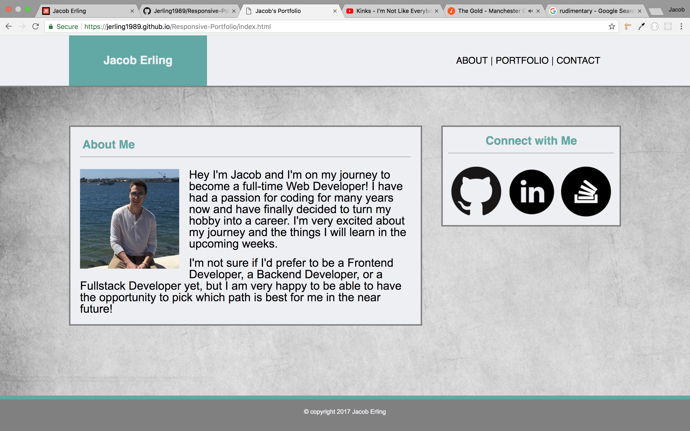
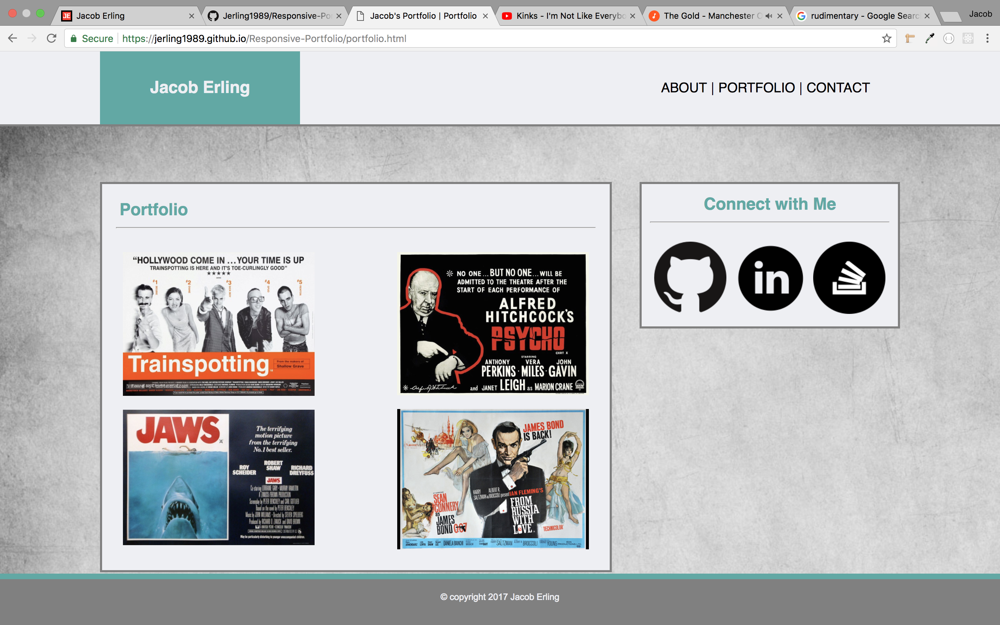
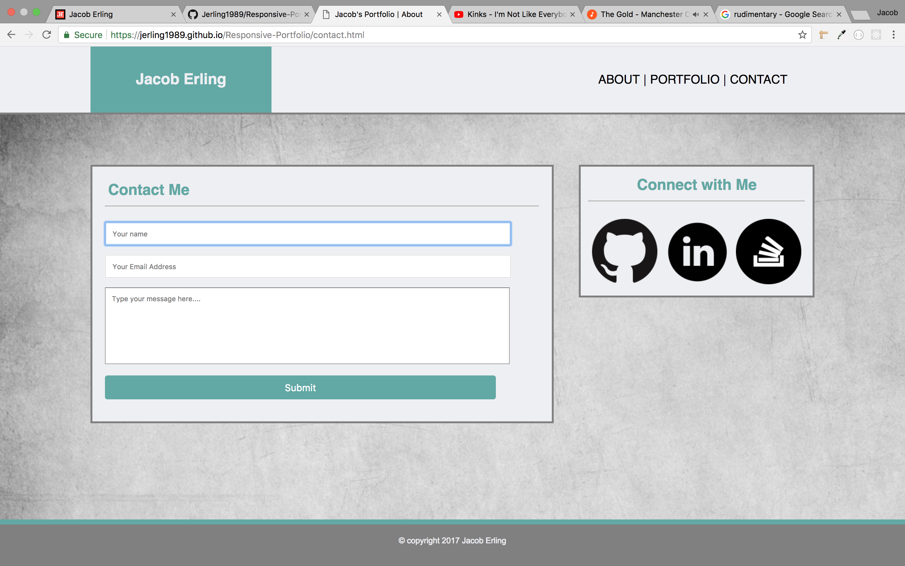

# Responsive_Portfolio
Here is a Portfolio Site using HTML and CSS, that is very similar to my Basic_Portfolio site. The big difference with this one is that I made it responsive using Media Queries in the CSS file. This was a very fun and interesting project that shows how to make a Responsive website without relying on CDN's like Bootstrap and Materialize. Media Queries were added to the CSS file at 1024px, 768px, and 640px to make the website mobile responsive.

---

- The first page the user will land on is the home or "about" page. It has a picture of me along with a description of who I am. It also has links to my GitHub, LinkedIn, and Stack Overflow accounts, as does every other page on this website.

- The next page is a mock portfolio section of the site. I added some movie posters from the UK because I liked the aesthetic of the horizontal landscape orientation on the page, as opposed to the vertical portrait orientation of US movie posters.

- Finally we have the Conact page that has a rudimentary (and non-functioning) contact form.

